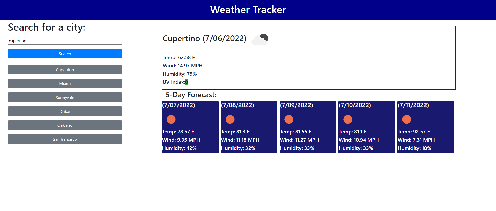

# Weather Tracker

## Description
This web application is a simple weather app that displays the current temperature and the five day forecast given a user input. I utilize OpenWeather's one call, and geocoding API to convert the user inputted city name to longitude and latitude coordinates to get relevent weather data. The users six most recent valid inputs are saved in local storage and displayed as buttons to quickly revist previously searched cities. 

## Deployed Site

## Deployed Site Link
[Link](https://hmanjun.github.io/weather-tracker/)

## Technologies
- HTML
- CSS
- JavaScript
- jQuery
- Bootstrap
- Momentjs
- OpenWeather One Call API
- OpenWeather Geocode API
- Git

## License
[Link](https://github.com/hmanjun/horiseon-refactor/blob/main/LICENSE)